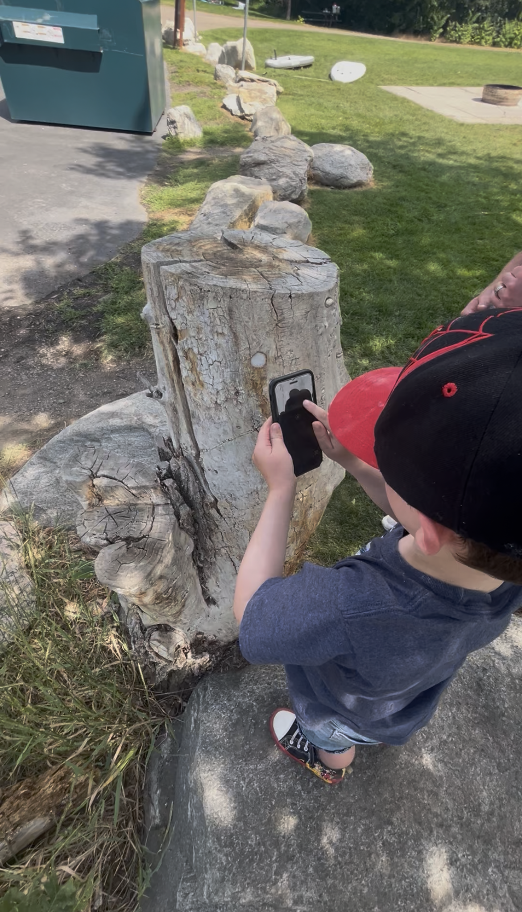

This app is designed to give your spirit of adventure, a direction to run in. With each GAAPP adventure you will find a mixture of puzzles, tasks, and games for you or a group to participate in. Simply unlock the adventure, and set off on your beginning task, scanning NFC tags located in target areas to unlock achievements, puzzles and clues. GAAPP strives to give you a variety of locations and challenges to ensure an immersive and interactive experience.

  
  
  

 

&nbsp; 

<a href="https://maps.app.goo.gl/jLEB5t4RgrjCwLWCA" target="\_blank" style="font-size: 60px; color: #ffffff; background-color: #264d5fe4; padding: 12px 20px; border-radius: 8px; font-family: sans-serif; text-decoration: none;">Locations</a>

&nbsp;

 

<a href="about.html" target="\\\_blank" style="font-size: 60px; color: #ffffff; background-color: #264d5fe4; padding: 12px 20px; border-radius: 8px; font-family: sans-serif; text-decoration: none;">what is GAAPP</a>

 <a href="download.html" target="\_blank" style="font-size: 60px; color: #ffffff; background-color: #264d5fe4; padding: 12px 20px; border-radius: 8px; font-family: sans-serif; text-decoration: none;">DownLoad APP</a>

 

